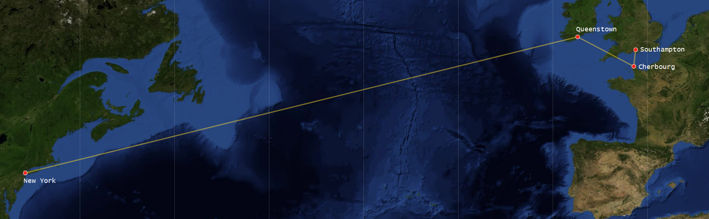
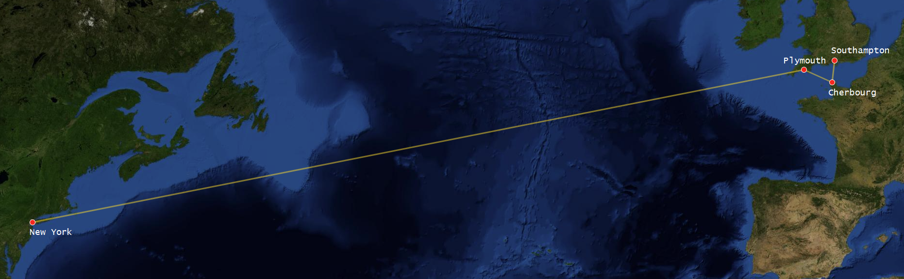

# Feature: Fastest Service

> As a marketing manager  
> I want to offer the fastest service  
> So that we have the edge over our competition (Cunard)

White Star Line plans to offer weekly crossings of the Atlantic in each
direction, leaving Southampton on Wednesdays and New York on Saturdays.

Both the Titanic, and her sister ship The Olympic, is scheduled to sail
throughout the year.

## Rule: Olympic-class ocean liners can cross the Atlantic in 1 week

The Titanic will depart on her Maiden Voyage from Southampton on 10 April 1912.
It will pick up passengers at Cherbourg in France and Queenstown in Ireland
before departing on a trans-Atlantic voyage to New York, USA.

The return trip is scheduled from New York to Plymouth in England, back to
Cherbourg, and finally to Southampton.

### Example: The itinerary from Southampton to New York

> Given Titanic is docked in the port of Southampton  
> When Titanic sails from Southampton to Cherbourg  
> and Titanic sails from Cherbourg to Queenstown  
> and Titanic sails from Queenstown to New York  
> Then Titanic's voyage is complete

### Example: Olympic-class ocean liners can complete the Atlantic crossing from Southampton to New York in 1 week

(Route image made with https://umap.openstreetmap.fr)

> Given Titanic is scheduled for the voyage to New York  
> and Titanic is docked in the port of Southampton  
> and the date is 1912-04-10  
> When Titanic sails from Southampton to New York  
> then Titanic is docked in the port of New York  
> and the date is 1912-04-17

### Example: Olympic-class ocean liners can complete the Atlantic crossing from New York to Southampton in 1 week

(Route image made with https://umap.openstreetmap.fr)

> Given Titanic is scheduled for the voyage to Southampton  
> and Titanic is docked in the port of New York  
> and the date is 1912-04-20  
> When Titanic sails from New York to Southampton  
> then Titanic is docked in the port of Southampton  
> and the date is 1912-04-27

## Rule: It is possible for Olympic-class ocean liners to complete all legs of the voyage

For a vessel to successfully complete its voyage, it must be able to dock in
all the ports along its planned route, as well as be able to deal with all
circumstances encoutered along its journey.

### Example: Southampton to Cherbourg

> Given Titanic is docked in the port of Southampton  
> When Titanic departs for the port of Cherbourg  
> and Titanic crosses area the English Channel  
> and Titanic arrives in the port of Cherbourg  
> then Titanic is docked in the port of Cherbourg

### Example: Cherbourg to Queenstown

> Given Titanic is docked in the port of Cherbourg  
> When Titanic departs for the port of Queenstown  
> and Titanic crosses area the English Channel  
> and Titanic arrives in the port of Queenstown  
> then Titanic is docked in the port of Queenstown

### Example: Queenstown to New York

> Given Titanic is docked in the port of Queenstown  
> When Titanic departs for the port of New York  
> and Titanic sails the Atlantic  
> and Titanic crosses Iceberg alley  
> and Titanic sails the Atlantic  
> and Titanic arrives in the port of New York  
> then Titanic is docked in the port of New York

## Rule: Olympic-class ocean liners can withstand icebergs

> As a Captain  
> I want to cross the Atlantic without incident  
> so that the safety of the crew, passengers and cargo is assured

During the crossing of the Atlantic ocean, various dangers are present, such as
adverse weather, other naval trafic and, not least of which, icebergs. Any of
these dangers can affect the seaworthyness of the ship, and thus threaten the
safety of the passengers and crew, and cause damage to cargo. Injuries to the
passengers and crew, or damaged cargo, could have financial implications as the
shipping company may be held liable.

In the area of the Altantic ocean known as Iceberg Alley, icebergs may be
present. The icebergs are a shipping hazard, as they may cause damage to any
ships that hit them. Any damage to the ship may affect the ship's
seaworthyness, and could cause delays.

<i>The area we call “Iceberg Alley” is located about 250 miles east and
southeast of the island of Newfoundland, Canada. Iceberg Alley is usually
considered to be that portion of the Labrador Current, that flows southward
from Flemish Pass, along the eastern edge of the Grand Banks of Newfoundland,
to the Tail of the Banks. This area extends approximately from 48 to 43 degrees
North Latitude at 48 degrees West longitude.  
(https://tallbloke.wordpress.com/2019/08/06/where-is-iceberg-alley/)</i>

![Iceberg Alley [credit: U.S. Coast Guard]](https://tallbloke.files.wordpress.com/2019/08/berg-alley.jpg)

### Example: Titanic hits an iceberg and it continues on its voyage

> Given Titanic is sailing Iceberg alley  
> when Titanic hits a huge iceberg  
> then Titanic continues on its voyage

### Example: Titanic barely misses a huge iceberg and it continues on its voyage

> Given Titanic is sailing Iceberg alley  
> when Titanic barely misses a huge iceberg  
> then Titanic continues on its voyage

<!-- trick for PDF page layout-->

